# Confronto di classificatori per il Dataset WDBC
## Elaborato per il corso di Analisi Dati
### Miriam Santoro
#### aa. 2017/2018, Università di Bologna - Corso di laurea magistrale in Fisica Applicata

## Scopo del progetto
Il presente lavoro è stato realizzato in linguaggio `Python3` e si pone come obiettivo l'implementazione e la valutazione di:
1. 10 classificatori creati utilizzando le funzioni della libreria `sklearn`,
2. un classificatore basato su una rete neurale costruito tramite la libreria `pytorch`.

Il progetto ha previsto anche l'implementazioni di altre librerie, oltre quelle già menzionate, quali:
1. `numpy`
2. `pandas`
3. `matplotlib`
4. `scipy`
5. `graphviz`

## Esecuzione del progetto
I classificatori sono stati implementati in due script diversi a seconda della libreria utilizzata. Nello specifico:
1. `Classification.py` contiene i classificatori definiti usando `sklearn`; ovvero:
    1. 10 classificatori implementati con possibilità di scegliere le features;
    2. Gli stessi 10 classificatori implementati tenendo conto delle 10 features migliori.
2. `NNC.py` contiene il classificatore definito usando Pytorch; ovvero:
    1. Il classificatore implementato con possibilità di scegliere le features;
    2. Lo stesso classificatore implementato tenendo conto delle 10 features migliori.
   
Questi due file Python sono stati implementati in `main.py`, script che è necessario eseguire per ottenere i risultati.
Inoltre, in `main.py` è stato importato anche lo script `Plotting.py`, utile per visualizzare i vari plot che verranno descritti nell'apposita sezione **Plotting**.

## Dataset (Note preliminari)
Il WDBC *Wisconsis Diagnostic Breast Cancer* è un dataset contenente 569 istanze, corrispondenti a 569 pazienti, ognuno dei quali classificato tramite un Id-paziente, un lettera indicante il tipo di tumore (maligno o benigno) e 30 features.
In particolare, le features legate al tumore indicano, in ordine:
1. Raggio (media delle distanze dal centro ai punti sul perimetro)
2. Texture (deviazione standard dei valori in scala di grigi)
3. Perimetro 
4. Area
5. Smoothness (variazione locale nelle lunghezze del raggio)
6. Compattezza (perimetro^2/area -1.0)
7. Concavità (gravità delle porzioni concave del contorno)
8. Punti concavi (numeri di porzioni concave del contorno)
9. Simmetria
10. Dimensioni frattali ("approssimazione coastline" -1)

Le features sono state calcolate da un'immagine digitalizzata di un fine aspiratore (FNA) di una massa del seno e descrivono le caratteristiche dei nuclei cellulari nell'immagine. Nello specifico per ogni immagine si hanno 30 features corrispondenti alla media, all'errore stardard e alla "peggiore" o più grande di ogni misura nell'elenco puntato e ogni cifra è stata acquisita con 4 digits. 

Inoltre, è necessario aggiungere che le 569 istanze possono essere divise in due classi, la prima avente 357 tumori benigni e la seconda avente 212 tumori maligni.


Una volta estratti i dati tramite la libreria `pandas` e aver disposto features e labels in array, si è utilizzata la funzione `model_selection.train_test_split` contenuta in `sklearn` per splittare in maniera diversa il dataset in training set e test set. Questi ultimi sono stati divisi come segue:
1. 90% training, 10% test
2. 80% training, 20% test
3. 50% training, 50% test 
4. 25% training, 75% test

Le divisioni sono state pensate in modo da evitare l'overfitting e valutare in varie condizioni le performance di tutti i classificatori utilizzati.
Le diverse divisioni sono state implementate tramite un ciclo for all'interno di tutti i classificatori, come è mostrato nelle seguenti righe di codice:

```python
seq = [.9, .8, .5, .25]
for i in seq:
    X_train, X_test, Y_train, Y_test = model_selection.train_test_split(X, Y, train_size=i, test_size= 1-i, 
                                                                        random_state=0)
```   

## Analisi dei classificatori utilizzati
Si analizzano e commentano di seguito i classificatori utilizzati in questo progetto.

### Classificatori da `sklearn`
I classificatori implementati grazie `sklearn` sono i seguenti:
1. LogReg (*Logistic Regression classifier*)
2. SVM (*Support Vector Machine classifier*)
3. DTC (*Decision Tree Classifier*)
4. KNC (*K Neighbor Classifier*)
5. RFC (*Random Forest Classifier*)
6. MLP (*Multi Layer Perceptron classifier*)
7. ABC (*Ada Boost Classifier*)
8. GNB (*Gaussian Naive Bayes classifier*)
9. QDA (*Quadratic Discriminant Analysis classifier*)
10. SGD (*Stochastic Gradient Descent classifier*)

In un primo momento, ciascuno di questi classificatori è stato eseguito e valutato al variare del numero di features. Nello specifico sono state prese in considerazione le seguenti casistiche:
1. 1 features 
2. 9 features
3. 16 features
4. 30 features

Per fare ciò è stato solo necessario cambiare i parametri d'ingresso alle funzioni utilizzate per ciascun classificatore, come è possibile notare nel seguente esempio di codice:
```python
#da main.py
l1 = Classification.LogReg(2,3)
m1 = Classification.LogReg(2,9)
n1 = Classification.LogReg(2,16)
o1 = Classification.LogReg(2,30)
```

Inoltre, dopo che, tramite la funzione `stats.spearmanr`, implementata all'interno di `Histo` in `Plotting.py`, si sono individuate le 10 features più correlate alle labels, sono stati realizzati classificatori uguali a quelli precedenti ma in modo che prendessero come input queste 10 specifiche features. 
La chiamata a uno di questi classificatori è mostrata nella seguente riga di codice:
```python
#da main.py
p1 = Classification.LogReg10()
```

#### 1. LogReg
Si usa l'implementazione standard del classificatore Logistic Regression contenuto nella libreria `sklearn.linear_model`. Questo è usato per valutare i parametri di un modello lineare generalizzato e viene applicato nei casi in cui si abbia una variabile dipendente binaria, ovvero una variabile con due possibili valori (nel nostro caso etichettati con "B"=0 e "M"=1).
La funzione utilizzata in questo modello è chiamata logistica ed è una funzione del tipo:

<a href="https://www.codecogs.com/eqnedit.php?latex=f(x)={\frac&space;{L}{1&plus;e^{-k(x-x_{0})}}}" target="_blank"></a>

dove:
- *e* = numero di Eulero,
- *x0* = valore sull'asse delle x del punto a metà della funzione sigmoide,
- *L* =  massimo valore della curva
- *k* = ripidezza della curva.

Nello specifico, per quanto riguarda il classificatore usato in questo progetto e mostrato di seguito:
```python
#da Classification.py
cl = linear_model.LogisticRegression(C=2.5)
```
si usano:
- *C=2.5* come inverso della forza di regolarizzazione, indicante la tolleranza di casi mal classificati, in quanto questo valore è poco al di sopra del valore di default 1 ed è utile per evitare errori di overfitting;
- altri parametri lasciati di default tra cui:
    - *solver='liblinear'* come risolutore, in quanto per piccoli dataset è una buona scelta
    - *penalty='l2'* come termine di penalizzazione
    
In seguito all'addestramento del classificatore tramite la funzione `fit`, viene utilizzata la funzione `predict` per fare previsioni sui dati di test e vengono calcolati rispettivamente report di classificazione, matrice di confusione e accuratezza.

#### 2. SVM
Si usa l'implementazione standard della Support Vector Classification contenuta nella libreria `sklearn.svm`. Questo classificatore è detto anche classificatore a massimo margine perchè, allo stesso tempo, minimizza l'errore empirico di classificazione e massimizza il margine geometrico. Nello specifico, cerca gli iperpiani di separazioni ottimali tramite una funzione obiettivo senza minimi locali.

Tra i vantaggi nell'uso del SVC si può trovare il fatto che:
- sia efficiente dal punto di vista della memoria in quanto usa un subset di punti di training nella funzione di decisione (chiamati support vectors);
- sia versatile poichè come funzioni di decisione è possibile specifcare diverse funzioni Kernel. Queste permettono di proiettare il problema iniziale su uno spazio di dimensioni superiore senza grandi costi computazionali e ottenendo separazioni basate anche su superfici non lineari.

Nello specifico, per quanto riguarda il classificatore usato in questo progetto e mostrato di seguito:
```python
#da Classification.py
cl=svm.SVC(kernel='linear')    
```
si usano:
- come funzione kernel, una funzione lineare del tipo:
<a href="https://www.codecogs.com/eqnedit.php?latex=\langle&space;x,&space;x'\rangle" target="_blank"></a>
- altri parametri di default, tra cui:
   - *C=1.0* come parametro di penalità per il termine di errore

In seguito all'addestramento del classificatore tramite la funzione `fit`, viene utilizzata la funzione `predict` per fare previsioni sui dati di test e vengono calcolati rispettivamente report di classificazione, matrice di confusione e accuratezza.

#### 3. DTC
Si usa l'implementazione standard del Decision Tree Classifier contenuto nella libreria `sklearn.tree`. Questo classificatore è usato per valutare i parametri di un modello al fine di predire il valore di un target variabile, apprendendo semplici regole di decisione dedotte dalle features. 
Il DTC, quindi, si basa su una struttura ad albero in cui:
- ogni nodo interno rappresenta un test su un attibuto;
- ogni nodo foglia rappresenta un'etichetta di classe.

Tra i vantaggi di questo classificatore è possible trovare il fatto che:
- sia semplice da capire ed interpretare in quanto si basa su un modello white box in cui l'interpretazione di una condizione è facilmente spiegata dalla logica booleana;
- gli alberi (*trees*) possano essere visualizzati;
- il costo di previsione dei dati sia logaritmico nel numero di punti di dati usati per allenare l'albero stesso.


Nello specifico, per quanto riguarda il classificatore implementato in questo progetto e mostrato di seguito:
```python
#da Classification.py
cl = tree.DecisionTreeClassifier()      
```
si usano i parametri di default, tra cui:
- *criterion='gini'* come funzione per misurare la qualità dello split; 
- *splitter='best'* come strategia usata per scegliere lo split (in questo caso, quello migliore) ad ogni nodo;
- *max_features=None* come numero di features da considerare quando si guarda allo split migliore. In questo caso max_features=n_features;
- *max_depth=None* come massima profondità dell'albero. Questo significa che i nodi vengono estesi fin quando tutte le foglie sono pure.

Inoltre, l'equazione di diminuzione di impurità pesata (che governa lo split ed è fornita da `sklearn`) è:

<a href="https://www.codecogs.com/eqnedit.php?latex=\frac{N_t}{N}&space;\cdot&space;\left(\text{impurity}&space;-&space;\frac{N_{t_R}}{N_t}&space;\cdot&space;\text{(right-impurity)}&space;-&space;\frac{N_{t_L}}{N_t}&space;\cdot&space;\text{(left-impurity)}&space;\right)" target="_blank"></a>

dove:
- *N* è il numero totale di campioni
- *N_t* è il numero di campioni al nodo corrente
- *N_{t_L}* è il numero di campioni nella parte destra
- *N_{t_R}* è il numero di campioni nella parte sinistra

In seguito all'addestramento del classificatore tramite la funzione `fit`, viene utilizzata la funzione `predict` per fare previsioni sui dati di test e vengono calcolati rispettivamente report di classificazione, matrice di confusione e accuratezza.

#### 4. KNC
Si usa l'implementazione standard del K-Neighbors Classifier contenuto nella libreria `sklearn.neighbors`. Questo classificatore non cerca di costruire un modello interno generale, ma semplicemente memorizza le istanze dei dati di training; quindi la classificazione è calcolata da un semplice voto di maggioranza dei vicini più vicini ad ogni punto: il punto di ricerca è assegnato alla classe più frequente tra i k esempi più vicini all'oggetto sotto esame.

k è un parametro intero specificato dall'utente e la sua scelta ottimale dipende fortemente dai dati. Ad esempio, in generale, una k più grande sopprime gli effetti del rumore ma rende i confini di classificazione meno distinti.

Nello specifico, per quanto riguarda il classificatore implementato in questo progetto e mostrato di seguito:
```python
#da Classification.py
cl = neighbors.KNeighborsClassifier(n_neighbors=3)       
```
si usano:
- *n_neighbors=3* come numero di vicini per evitare situazioni di parità;
- altri parametri di default tra cui:
    - *weights='uniform'* come funzione per i pesi usata per la previsione. I pesi uniformi portano a considerare equamente tutti i punti in ogni vicinato;
    - *algorithm='auto'* come algoritmo usato per calcolare i vicini. Questo è l'algoritmo più appropriato sulla base dei valori passati dal metodo di fit;
    - *metric='minkowski'* come distanza usata per l'albero.
    
In seguito all'addestramento del classificatore tramite la funzione `fit`, viene utilizzata la funzione `predict` per fare previsioni sui dati di test e vengono calcolati rispettivamente report di classificazione, matrice di confusione e accuratezza.

#### 5. RFC 
Si usa l'implementazione standard del Random Forest Classifier contenuto nella libreria `sklearn.ensemble`. Questo classificare fa il fit di un numero di classificatori decision trees su vari sotto-campioni del dataset e usa la media per migliorare l'accuratezza predittiva e controllare l'over-fitting. La grandezza dei sotto campioni è uguale a quella del campione di input iniziale ma i campioni sono disegnati con rimpiazzamento dal set di training. 
Inoltre, quando si fa la divisione di un nodo durante la costruzione dell'albero, lo split che viene scelto non è il migliore tra tutte le features ma tra un subset random di features. A causa di questa randomicità, il bias della foresta dovrebbe aumentare (rispetto a quello di un singolo albero non-random) ma, grazie alla media, la sua varianza diminuisce e compensa di più l'aumento del bias determinando un modello migliore.

Nello specifico, per quanto riguarda il classificatore usato in questo progetto e mostrato di seguito:
```python
#da Classification.py
cl=ensemble.RandomForestClassifier(max_depth=15, n_estimators=10, max_features=1)      
```
si usano:
- *max_depth=15* come massima espansione dell'albero;
- *n_estimators=10* come numero di alberi (estimatori) nella foresta;
- *max_features=1* come numero di features da considerare quando si guarda al migliore split;
- altri parametri di default, tra cui:
    - *criterion='gini'* come funzione per misurare la qualità dello split;
    - $*min_samples_split=2* come numero minimo di campioni richiesto per dividere un nodo interno.

In seguito all'addestramento del classificatore tramite la funzione `fit`, viene utilizzata la funzione `predict` per fare previsioni sui dati di test e vengono calcolati rispettivamente report di classificazione, matrice di confusione e accuratezza.

#### 6. MLP
Si usa l'implementazione standard del Multi Layer Perceptron contenuto nella libreria `sklearn.neural_network`. Questo classificatore si basa su una rete neurale e su un allenamento iterativo. Infatti, ad ogni step temporale vengono calcolate le derivate parziali della funzione di perdita rispetto ai parametri del modello e vengono aggiornati i parametri stessi.
Può avere anche un termine di regolarizzazione aggiunto alla funzione di perdita che restringe i parametri del modello per prevenire l'overfitting.

Nello specifico, per quanto riguarda il classificatore utilizzato in questo progetto e mostrato di seguito:
```python
#da Classification.py
cl = neural_network.MLPClassifier(activation='logistic', solver='lbfgs', max_iter=1000 )       
```
si usano:
- *activation='logistic'* come funzione di attivazione per gli strati nascosti. Questa è una funzione logistica sigmoidale che restituisce:

<a href="https://www.codecogs.com/eqnedit.php?latex=f(x)&space;=&space;\frac{1}{1&plus;exp(-x)}" target="_blank"></a>
   
- *solver='lbfgs'* come risolutore per l'ottimizzazione dei pesi. Questo è un ottimizzatore facente parte dei metodi quasi-newtoniani ed è stato scelto in quanto per piccoli datasets, come il wdbc, converge più velocemente e ha migliori performance;
- *max_iter=1000* come numero massimo di iterazioni per la convergenza;
- altri parametri di default, tra cui:
    - *hidden_layer_sizes=(100,)}* come dimensioni degli strati nascosti;
    - *alpha=0.0001* come parametro di penalizzazione L2;
    - *batch_size=min(200,n_samples)}* come grandezza di batch;
    - *learning_rate=costant=0.001* come frequenza di apprendimento per l'aggiornamento dei pesi.
 
In seguito all'addestramento del classificatore tramite la funzione `fit`, viene utilizzata la funzione `predict` per fare previsioni sui dati di test e vengono calcolati rispettivamente report di classificazione, matrice di confusione e accuratezza.

#### 7. ABC
Si usa l'implementazione standard dell'Ada Boost Classifier contenuto nella libreria `sklearn.ensemble`. Questo classificatore inizialmente fa il fit di un modello debole (leggermente migliore di uno random) sul dataset e poi di sue copie aggiuntive sullo stesso dataset ma in cui i pesi di istanze di training classificate non correttamente sono aggiustati, in modo da focalizzare l'attenzione su casi più difficili. 

Iniziamente, i pesi sono tutti settati a 1/N, così che il primo step alleni semplicemente un debole modello dei dati originali; tuttavia, per ogni iterazione successiva, sono modificati individualmente in modo che:
- i pesi associati agli esempi di training che non sono predetti correttamente vengano aumentati;
- i pesi associati agli esempi di training che sono predetti correttamente vengano diminuiti.

Successivamente l'algoritmo di apprendimento viene riapplicato per ripesare i dati. In questo modo ogni volta che le iterazioni procedono, gli esempi difficili da predire ricevono un'influenza sempre crescente e ogni modello debole viene forzato a concentrarsi sugli esempi che mancano dai precedenti nella sequenza.
Infine, le previsioni vengono combinate attraverso una somma pesata per produrre la previsione finale. 

Nello specifico, per quanto riguarda il classificatore usato in questo progetto e mostrato di seguito:
```python
#da Classification.py
cl=ensemble.AdaBoostClassifier()       
```
si usano i parametri di default, tra cui:
- *base_estimator=None=DecisionTreeClassifier(max_depth=1)}* come estimatore base da cui è costruito l'ensemble (di classificatori) potenziato;
- *n_estimators=50* come numero di estimatori a cui viene concluso il potenziamento;
- *learning_rate=1* come frequenza di apprendimento;
- *algorithm='SAMME.R'* come algoritmo di potenziamento. Questo converge velocemente, raggiungendo un minore errore di testing con minori iterazioni di boosting.

In seguito all'addestramento del classificatore tramite la funzione `fit`, viene utilizzata la funzione `predict` per fare previsioni sui dati di test e vengono calcolati rispettivamente report di classificazione, matrice di confusione e accuratezza.

#### 8. GNB
Si usa l'implementazione standard del Gaussian Naive Bayes contenuto nella libreria `sklearn.naive_bayes`. Questo classificatore si basa sull'applicazione del teorema di Bayes, con l'assunzione di una forte (naive) indipendenza condizionata tra ogni coppia di features, dato il valore della variabile di classe.
Il teorema di Bayes stabilisce che, data la variabile di classe $y$ e il vettore di feature dipendente $x_1$ attraverso $x_n$, si ha:

<a href="https://www.codecogs.com/eqnedit.php?latex=P(y&space;\mid&space;x_1,&space;\dots,&space;x_n)&space;=&space;\frac{P(y)&space;P(x_1,&space;\dots&space;x_n&space;\mid&space;y)}&space;{P(x_1,&space;\dots,&space;x_n)}" target="_blank"></a>

L'assunzione di indipendenza naive condizionale, invece, stabilisce che:

<a href="https://www.codecogs.com/eqnedit.php?latex=P(x_i&space;|&space;y,&space;x_1,&space;\dots,&space;x_{i-1},&space;x_{i&plus;1},&space;\dots,&space;x_n)&space;=&space;P(x_i&space;|&space;y)" target="_blank"></a>

Questo classificatore implementa l'algoritmo Gaussian Naive Bayes per la classificazione in cui si assume che la likelihood delle features sia gaussiana:

<a href="https://www.codecogs.com/eqnedit.php?latex=P(x_i&space;\mid&space;y)&space;=&space;\frac{1}{\sqrt{2\pi\sigma^2_y}}&space;\exp\left(-\frac{(x_i&space;-&space;\mu_y)^2}{2\sigma^2_y}\right)" target="_blank"></a>

dove i parametri <a href="https://www.codecogs.com/eqnedit.php?latex=\sigma_y" target="_blank"></a> e <a href="https://www.codecogs.com/eqnedit.php?latex=\mu_y" target="_blank"></a> sono stimati usando il massimo della likelihood.

Tra i vantaggi di questo classificatore troviamo il fatto che:
- richieda una piccola quantità di dati di training per stimare i parametri necessari;
- possa essere estremamente veloce se confrontato con metodi più sofisticati;
- il disaccoppiamento delle distribuzioni di features condizionali delle classi possa essere stimato indipendentemente come una distribuzione unidimensionale e questo aiuta a ridurre i problemi che derivano dalla 'maledizione' della dimensionalità.


Nello specifico, per quanto riguarda il classificatore usato in questo progetto e mostrato di seguito:
```python
#da Classification.py
cl=naive_bayes.GaussianNB()    
```
si usano i parametri di default, tra cui:
- *priors=(n_classes,)}* come probabilità a priori delle classi;
- *var_smoothing=1e-9* come porzione della varianza più grande tra tutte le features. Questa viene aggiunta alle varianze per il calcolo della stabilità.

In seguito all'addestramento del classificatore tramite la funzione `fit`, viene utilizzata la funzione `predict` per fare previsioni sui dati di test e vengono calcolati rispettivamente report di classificazione, matrice di confusione e accuratezza.

#### 9. QDA
Si usa l'implementazione standard della Quadratic Discriminant Analysis contenuta nella libreria `sklearn.discriminant_analysis`. Questo classificatore può essere ottenuto da semplici modelli probabilistici che modellano la distribuzione condizionale di classe dei dati *P(X|y=k)* per ogni classe *k*. 
Le previsioni possono essere ottenute usando la regola di Bayes:

<a href="https://www.codecogs.com/eqnedit.php?latex=P(y=k&space;|&space;X)&space;=&space;\frac{P(X&space;|&space;y=k)&space;P(y=k)}{P(X)}" target="_blank"></a>

Nello specifico, *P(X|y)* è modellizzato come una distribuzione Gaussiana multivariata con densità:

<a href="https://www.codecogs.com/eqnedit.php?latex=P(X&space;|&space;y=k)&space;=&space;\frac{1}{(2\pi)^{d/2}&space;|\Sigma_k|^{1/2}}\exp\left(-\frac{1}{2}&space;(X-\mu_k)^t&space;\Sigma_k^{-1}&space;(X-\mu_k)\right)" target="_blank"></a>

dove *d* è il numero di features.

In poche parole, questo è un classificatore con un confine di decisione quadratico che è generato fittando le densità condizionali  delle classi e usando la regola di Bayes.

Nello specifico, per quanto riguarda il classificatore usato in questo progetto e mostrato di seguito:
```python
#da Classification.py
cl=discriminant_analysis.QuadraticDiscriminantAnalysis()      
```
si usano i parametri di default, tra cui:
- *priors=n_classes* come priori sulle classi;
- *tol=1.0e-4* come soglia usata per la stima del rango.

In seguito all'addestramento del classificatore tramite la funzione `fit`, viene utilizzata la funzione `predict` per fare previsioni sui dati di test e vengono calcolati rispettivamente report di classificazione, matrice di confusione e accuratezza.

#### 10. SGD
Si usa l'implementazione standard della Stochastic Gradient Descent contenuta nella libreria `sklearn.linear_model`. Questo è un classificatore lineare con un apprendimento che sfrutta il gradiente di discesa stocastica (SGD). Infatti, per ogni campione:
- è stimato il gradiente di perdita;
- è aggiornato il modello man mano con una frequenza di apprendimento decrescente.

Inoltre, è possibile aggiungere alla funzione di perdita un termine di penalità per restringere i parametri del modello.

Nello specifico, per quanto riguarda il classificatore usato in questo progetto e mostrato di seguito:
```python
#da Classification.py
cl = linear_model.SGDClassifier(loss="perceptron", penalty="elasticnet", max_iter=600)   
```
si usano:
- *loss='perceptron'* come funzione di perdita lineare usata dall'algoritmo del percettrone;
- *penalty='elasticnet'* come termine di penalità. In questo caso, è una combinazione di L2 (norma euclidea quadrata) e L1 (norma assoluta);
- *max_iter=600* come massimo numero di passi sui dati di training;
- altri parametri di default, tra cui:
    - *tol=1e-3* come criterio di stop.

In seguito all'addestramento del classificatore tramite la funzione `fit`, viene utilizzata la funzione `predict` per fare previsioni sui dati di test e vengono calcolati rispettivamente report di classificazione, matrice di confusione e accuratezza.

### Classificatore da `pytorch`
Il classificatore implementato grazie `pytorch` è il seguente:
1. NNC (*Neural Network Classifier*)

Per quanto riguarda questo classificatore si è sfruttato il One Hot Encoding, un processo tramite cui è possibile convertire le labels in numeri binari. In questo caso, quindi, sono stati associati *[1,0]* e *[0,1]* alle due possibili uscite (rispettivamente *B* e *M*) e questo passaggio è risultato indispensabile poichè `pytorch` è in grado di funzionare solo su dati numerici.

#### NNC 
Per l'implementazione della NNC si utilizza della libreria `pytorch` che sfrutta una sintassi basata su tensori e programmazione ad oggetti.

La struttura della rete neurale è costituita da: 
1. un livello lineare che va da e-s a 15 canali, dove s ed e sono rispettivamente la prima e l'ultima feature considerate;
2. un livello di passaggio per la funzione ReLU, utile per scartare i valori negativi ottenuti finora;
3. un livello lineare che va da 15 a 10 canali;
4. un livello di passaggio per la funzione ReLU, avente lo stesso scopo del livello 2;
5. un livello finale lineare che va da 10 a 2 canali.

Per l'addestramento della CNN si sottopone alla rete neurale l'intero dataset mescolato più volte, dove il numero di "mescolamenti" è detto `epoch`.

Come funzione di errore si utilizza *SmoothL1Loss* perchè ritenuta adeguata per una classificazione 2-classi e perchè risultata migliore rispetto alle altre funzioni di errore candidate. Questa funzione si basa su un criterio che usa un termine quadrato se l'errore assoluto element-wise cade al di sotto dell'1 e un termine L1 altrimenti. Inoltre, è meno sensibile ai valori anomali rispetto al MSELoss ed è conosciuta anche come Huber loss:

<a href="https://www.codecogs.com/eqnedit.php?latex=\text{loss}(x,&space;y)&space;=&space;\frac{1}{n}&space;\sum_{i}&space;z_{i}" target="_blank"></a>

dove *z_i* è data da:

<a href="https://www.codecogs.com/eqnedit.php?latex=z_{i}&space;=&space;\begin{cases}&space;0.5&space;(x_i&space;-&space;y_i)^2,&space;&&space;\text{se&space;}&space;|x_i&space;-&space;y_i|&space;<&space;1&space;\\&space;|x_i&space;-&space;y_i|&space;-&space;0.5,&space;&&space;\text{altrimenti&space;}&space;\end{cases}" target="_blank"></a>

Insieme a questa si usa come funzione di ottimizzazione `torch.optim.Adam`, una funzione adattiva dotata di gradient descent e suggerita dalla documentazione di `pytorch` per l'addestramento.
Durante l'addestramento si calcola quindi la backpropagation dell'errore lungo tutta la rete e si esegue uno step di ottimizzazione la cui dimensione è definita dal `learning_rate`(=0.005, in questo caso) nella funzione `torch.optim.Adam`.

Per quanto riguarda il testing e l'accuratezza delle previsioni fatte dalla rete neurale si usano le funzioni `np.argmax` contenute nella libreria `sklearn`.

Di seguito, si riporta lo script della rete neurale, comprendente addestramento e testing:
```python
#da NNC.py
import numpy as np
import pandas as pd
import torch
import torch.nn as nn
import torch.utils.data
import torch.optim as optim
from torch.autograd import Variable
from sklearn import model_selection
from sklearn.preprocessing import LabelEncoder, OneHotEncoder

def NNC(s,e):
    myList = []
    f=open("wdbc.data.txt")
    data_train = pd.read_csv("wdbc.data.txt", header=None, sep=r"\s+")
    X = np.array(data_train)
    
    pre_lab=X[:,1]  
    features=X[:,s:e]
    
    pre_labels=[]
    label_encoder = LabelEncoder()                                  
    pre_labels = label_encoder.fit_transform(pre_lab)
    pre_labels = np.array(pre_labels)
    
    labels=[]
    for num in range(len(pre_labels)):
        if pre_labels[num] == 0:
            labels.append([1,0])
        if pre_labels[num] == 1:
            labels.append([0,1])
    labels = np.array(labels)
    
    seq=[.9, .8, .5, .25]
    for i in seq:

        features_train, features_test, labels_train, labels_test = model_selection.train_test_split(features, 
                                                                                                    labels, train_size=i,
                                                                                                    test_size=1-i,
                                                                                                    random_state=0)
        features_train = np.array(features_train, dtype=np.float32)
        features_test = np.array(features_test, dtype=np.float32)
        labels_train = np.array(labels_train, dtype=np.int64)
        labels_test = np.array(labels_test, dtype=np.int64)
        
        features_train_v = Variable(torch.Tensor(features_train), requires_grad = False)
        labels_train_v = Variable(torch.Tensor(labels_train), requires_grad = False)
        features_test_v = Variable(torch.Tensor(features_test), requires_grad = False)
        labels_test_v = Variable(torch.Tensor(labels_test), requires_grad = False)
         
        model = nn.Sequential(nn.Linear(e-s, 15),    
                     nn.ReLU(),
                     nn.Linear(15, 10),
                     nn.ReLU(),
                     nn.Linear(10,2))
        
        loss_fn = torch.nn.SmoothL1Loss()
        optim = torch.optim.Adam(model.parameters(), lr=0.005)
        
        #training
        all_losses=[]
        for num in range(2000):
            optim.zero_grad()                                 # Intialize the hidden weights to all zeros
            pred = model(features_train_v)                    # Forward pass: Compute the output class
            loss = loss_fn(pred, labels_train_v)              # Compute the loss: difference between the output class and                                                                      the pre-given label
            all_losses.append(loss.data)
            loss.backward()                                   # Backward pass: compute the weight
            optim.step()                                      # Optimizer: update the weights of hidden nodes
            
            print('epoch: ', num,' loss: ', loss.item())      # Print statistics       
            
        #testing
        predicted_values=[]
    
        for num in range(len(features_test_v)):
            predicted_values.append(model(features_test_v[num]))
        
        score = 0
        for num in range(len(predicted_values)):
            if np.argmax(labels_test[num]) == np.argmax(predicted_values[num].data.numpy()):
                score = score + 1     
        accuracy = float(score / len(predicted_values)) * 100
        
        if accuracy <= 70:
            print ("Testing Accuracy Score is: %0.2f " % (accuracy))
            print("Run it again!")
        else:
            print ("Testing Accuracy Score is: %0.2f " % (accuracy))
    
        myList.append(accuracy)
    
    print(myList)    
    return myList 
```

## Plotting 
Le seguenti funzioni sono implementate in `Plotting.py`.

### Plot
La funzione plot è stata implementata tramite la libreria `matplolib`. In questo modo è possibile visualizzare in un plot bidimensionale la popolazione del dataset iniziale e dei vari splitting effettuati per ottenere training set e test set.
I dati con cui è stato riempito il plot bidimensionale sono solo legati all'id-paziente e al tipo di tumore, non alle features.
E' stato possibile realizzare questi grafici tramite la funzione `scatter`. 
I risultati sono mostrati nelle seguenti figure:

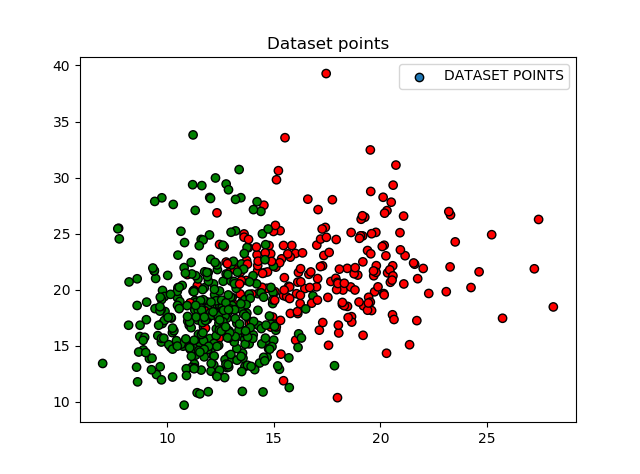
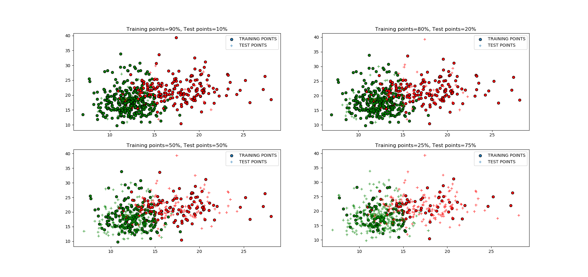

### Histo
La funzione è stata implementata tramite la libreria `matplotlib` ed è stata creata per visualizzare graficamente, tramite un istogramma, i risultati riguardanti la correlazione tra le varie features e le labels del dataset in modo da decretare le 10 features migliori. 
La correlazione, non avendo dati distribuiti normalmente, è stata studiata tramite il coefficiente di Spearman. Infatti, è stata ottenuta tramite la funzione `spearmanr` implementata dalla libreria `scipy.stats` e restituente valori di correlazione compresi tra -1 e 1, dove lo 0 indica la non-correlazione. Come è possibile notare dalla seguente figura, le 10 features classificate come migliori sono quelle corrispondenti alle colonne: 2,4,5,8,9,15,22,24,25,29 del file *wdbc.data.txt* (si ricorda che le prime due colonne sono quelle relative a id-paziente e tipologia del tumore).

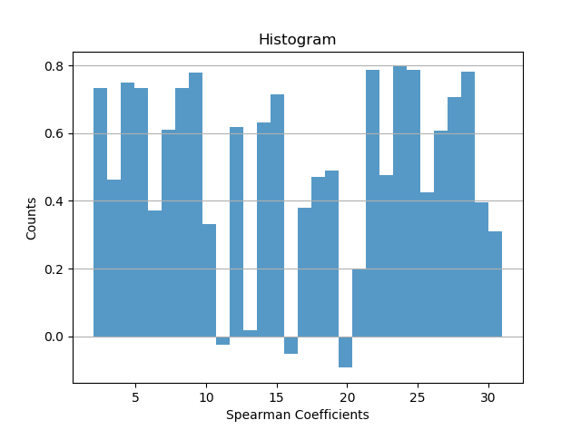

### SVC plotting 
Tramite la funzione `SVCPlot(s,e)`, nel caso particolare in cui si abbiano due features di input, vengono plottati quattro diversi SVC e la loro rispettiva decision function. I classificatori usati sono i seguenti:
```python
#da Plotting.py
C=1.0  #parametro di penalità per il termine di errore
svc = svm.SVC(kernel='linear', C=C)
rbf_svc = svm.SVC(kernel='rbf', gamma=0.7, C=C)
rbf_NuSVC = svm.NuSVC(kernel='rbf')
lin_svc = svm.LinearSVC(C=C)
```
dove:
1. svc è il classificatore di cui si è parlato nella sezione **SVM**;
2. rbf_svc è un classificatore avente come kernel una funzione a base radiale (radial basis function), ovvero del tipo:

    <a href="https://www.codecogs.com/eqnedit.php?latex=\exp(-\gamma&space;\|x-x'\|^2)" target="_blank"></a>
    
3. rbf_NuSVC è un classificatore simile a SVC ma accetta set di parametri leggermente diversi e ha una diversa formulazione matematica. Nello specifico sfrutta un parametro che controlla il numero di support vectors (limite inferiore) e gli errori di allenamento (limite superiore). Anche in questo caso si è utilizzato come kernel una funzione a base radiale (rbf);
4. lin_svc è un classificatore lineare support vector ed è simile al primo classificatore (svc avente un kernel lineare) ma è implementato tramite la libreria `liblinear`, anzichè `libsvm`. Questo permette di avere più flessibilità nella scelta dei termini di penalizzazione e delle funzioni di perdita. I parametri sono lasciati di default e tra questi è possibile notare:
    - *penalty=l2* come termine di penalizzazione;
    - *loss='hinge'* come funzione di perdita.
    
Nel caso dell'uso delle due input features mostrate nella seguente riga di codice:
```python
#da main.py
Classification.SVC(2,4)    
```
il risultato che si ottiene è il seguente:

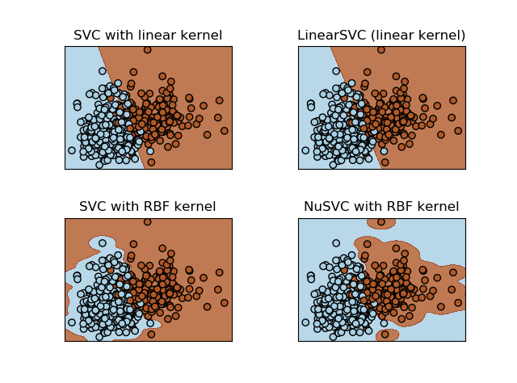

### DTC plotting 
Tramite la funzione `DTCPlot(s:e)` è possibile ottenere in formato pdf il DTC generato, al variare dei diversi splitting di training e test e del numero di features prese in considerazione.
In figura è mostrato un esempio di Tree generato, prendendo in considerazione 30 features, un training set del 80% e un test set del 20%.

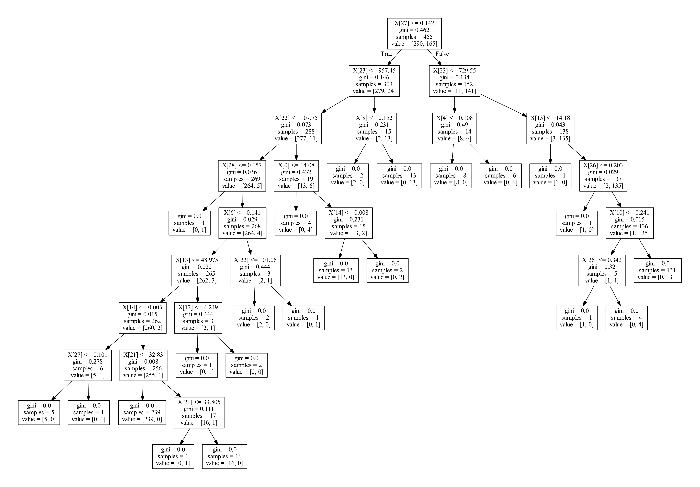

### Plot3B
Tramite la funzione `Plot3B()` è possibile ottenere un grafico 3-dim avente sui 3 assi le 3 features migliori, dedotte tramite l'istogramma (`Histo()`). Come è possibile notare dalla figura, sembra esserci un andamento lineare sia per i tumori benigni che per quelli maligni ma nel secondo caso, questo andamento presenta delle maggiori variazioni. 
Il risultato è mostrato di seguito:

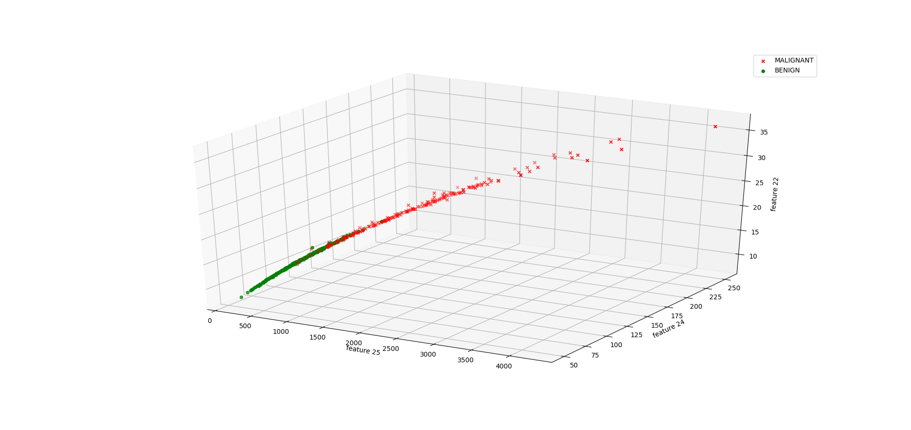

## Esecuzione del programma
Lo script finale `main.py` fa uso di tutti i classificatori (`Classification.py`, `NNC.py`) e dello script riguardante i vari plotting (`Plotting.py`). Nello specifico:
1. Fa il plot della popolazione iniziale e dei vari splitting implementati, come già spiegato nella sezione **Plot**, tramite la riga di codice:
    ```python
        Plotting.Plot()
    ```
2. Carica ed esegue gli 11 classificatori, tenendo conto di un diverso numero di features (1, 9, 16, 30). Inoltre, ricava grandezze utili per valutare e confrontare i vari classificatori. Nello specifico:
    - per ogni classificatore implementato con `sklearn` stampa su terminale i risultati relativi a:
        1. matrice di confusione, grazie alla funzione `metrics.confusion_matrix`
        2. report di classificazione, grazie alla funzione `metrics.classification_report`
        3. accuratezza, grazie alla funzione `metrics.accuracy_score`.
    - per il classificatore implementato con `pytorch` stampa su terminale i risultati relativi all'accuratezza, grazie alle righe di codice spiegate nella sezione **NNC**.
    
3. Salva in un DataFrame i risultati relativi alle accuratezze dei vari classificatori.

4. Fa il plot delle funzioni di decisione per SVC nelle varie casistiche, prendendo in considerazione solo due features. Questo è implementato tramite la riga di codice:
    ```python
        Plotting.SVCPlot(s,e)
    ```
5. Permette di ottenere il Decision Tree, di esportarlo e salvarlo in un file pdf tramite la riga di codice:
    ```python
        Plotting.DTCPlot(s,e)
    ```
6. Realizza un istogramma monodimensionale raffigurante i coefficienti di correlazione di Spearman per ogni feature, in modo da individuare e visualizzare le 10 features migliori, tramite la riga di codice:
    ```python
        Plotting.Histo()
    ```
7. Carica ed esegue gli 11 classificatori, tenendo conto delle 10 features migliori. Stampa su terminale le stesse grandezze ottenute nel p.to 2.

8. Salva in un DataFrame i risultati relativi alle accuratezze dei vari classificatori.

9. Realizza un plot tridimensionale delle 3 features migliori per visualizzarne l'andamento.

## Risultati e commenti finali
Una volta fatto girare il programma, i risultati ottenuti per un training set dell'80% e un test set del 20% sono i seguenti:

**1 feature (sx) e 9 features (dx)**

|Classificatore|Errori Commessi|Percentuale letta correttamente|Classificatore|Errori Commessi|Percentuale letta correttamente| 
|:--|:--:|:--:|:--|:--:|:--:|
|1. LogReg|10/114|91.23%|1. LogReg|9/114|92.11%|
|2. SVM|9/114|92.11%|2. SVM|10/114|91.23%|
|3. DTC|18/114|84.21%|3. DTC|8/114|92.98%|
|4. KNC|15/114|86.84%|4. KNC|15/114|86.84%|
|5. RFC|19/114|83.33%|5. RFC|5/114|95.61%|
|6. MLP|12/114|89.47%|6. MLP|10/114|91.23%|
|7. ABC|14/114|87.72%|7. ABC|6/114|94.74%|
|8. GNB|12/114|89.47%|8. GNB|13/114|88.60%|
|9. QDA|12/114|89.47%|9. QDA|6/114|94.74%|
|10. SGD|13/114|88.60%|10. SGD|13/114|88.60%|
|11. NNC|15/114|86.84%|11. NNC|6/114|94.74%|

**16 features (sx) e 32 features (dx)**

|Classificatore|Errori Commessi|Percentuale letta correttamente|Classificatore|Errori Commessi|Percentuale letta correttamente| 
|:--|:--:|:--:|:--|:--:|:--:|
|1. LogReg|6/114|94.74%|1. LogReg|5/114|95.61%|
|2. SVM|8/114|92.98%|2. SVM|5/114|95.61%|
|3. DTC|9/114|92.11%|3. DTC|10/114|91.23%|
|4. KNC|12/114|89.47%|4. KNC|10/114|91.23%|
|5. RFC|8/114|92.98%|5. RFC|5/114|95.61%|
|6. MLP|7/114|93.86%|6. MLP|11/114|90.35%|
|7. ABC|5/114|95.61%|7. ABC|5/114|95.61%|
|8. GNB|11/114|90.35%|8. GNB|6/114|92.98%|
|9. QDA|5/114|95.61%|9. QDA|5/114|95.61%|
|10. SGD|19/114|83.33%|10. SGD|19/114|83.33%|
|11. NNC|5/114|95.61%|11. NNC|7/114|93.86%|


**10 features migliori**

|Classificatore|Errori Commessi|Percentuale letta correttamente|
|:--|:--:|:--:|
|1. LogReg|7/114|93.86%|
|2. SVM|8/114|92.98%|
|3. DTC|7/114|93.86%|
|4. KNC|9/114|92.11%|
|5. RFC|5/114|95.61%|
|6. MLP|10/114|91.23%|
|7. ABC|4/114|96.49%|
|8. GNB|8/114|92.98%|
|9. QDA|7/114|93.86%|
|10. SGD|14/114|87.72%|
|11. NNC|6/114|94.74%|

Osservando le tabelle è possibile notare come i classificatori migliori risultino:
1. ABC che compare tra le performance migliori in presenza di 9,16,30 e 10 best ma non in 1 feature;
2. QDA che compare tra le performance migliori in presenza di 1,9,16 e 30 ma non in 10 best;
3. NNC che compare tra le performance migliori in presenza di 9,16,10 best ma non in 1,30 features.


Bisogna specificare che il fatto che questi classificatori non compaiano tra le performance migliori in alcuni casi, non vuol dire che classifichino male ma che altri classificatori sono risultati migliori, a parità di condizioni. Infatti:
1. ABC ha una performance dell' 87.72%, rispetto a SVM (92.11% = migliore performance) in presenza di 1 feature;
2. QDA ha una performane del 93.86%, rispetto a ABC (96.49% = migliore perfomance) in presenza di 10 best; 
3. NNC ha una performance:
    1. dell' 86.84% rispetto a SVM (92.11% = migliore performance) in presenza di 1 feature;
    2. del 93.86% rispetto a SVM (95.61% = migliore performance) in presenza di 30 features.

Inoltre, in generale si può notare come le performance dei classificatori migliorino significativamente all'aumentare del numero di features prese in considerazione durante la classificazione. Questo è in linea con quanto ci si aspetta teoricamente quando si parla di "maledizione" della dimensionalità.

Il fatto che i 3 classificatori migliori siano ABC, QDA e NNC è spiegabile con:
1. ABC e NNC sono classificatori adattativi. Inoltre, in generale, i classificatori basati su reti neurali sono la soluzione più rapida e diretta per avere performance consistenti;
2. QDA si basa su una linea di decisione quadratica e sul teorema di Bayes. I classificatori bayesiani sono caratterizzati dalla minima probabilità di errore (Bayes Error Rate), ovvero migliore che un classificatore possa fare. Il fatto che GNB non lavori bene come QDA potrebbe essere legato alla minore flessibilità del primo modello in cui si fa anche un'assunzione di non correlazione tra le variabili all'interno di una stessa classe.

### Extra
In questa sezione, sono mostrati per completezza di contenuti, i DataFrame con i dati relativi alle accuratezze dei classificatori per i vari splitting tra training e test.
**Dataframe: 1 feature**
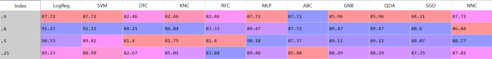
**Dataframe: 9 features**
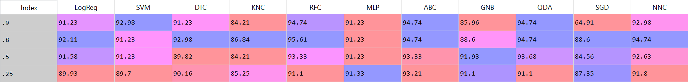
**Dataframe: 16 features**
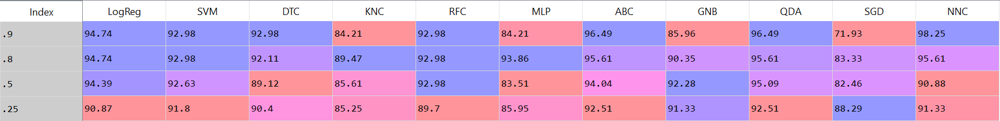
**Dataframe: 30 features**
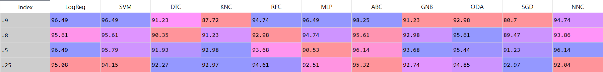
**Dataframe: 10 features migliori**
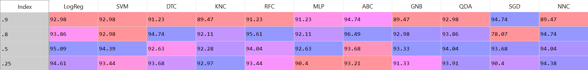


